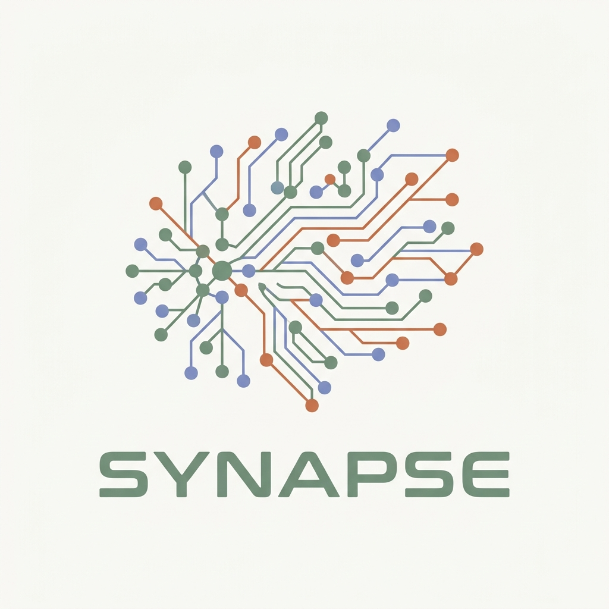

<div align="center">
  
  
  # Synapse | Neural Dashboard
  ### The Executive Command Center for Personal Optimization
  
  [](https://vitejs.dev/)
  [](https://reactjs.org/)
  [](https://tailwindcss.com/)
  [](https://firebase.google.com/)
</div>

---

## 🚩 The Problem
As life becomes increasingly complex, our most vital data—**productivity**, **financial capital**, and **physical health**—ends up scattered across fragmented apps and spreadsheets. This fragmentation creates a "data noise" that leads to executive paralysis, wasted resources, and a lack of clear direction.

## ⚡ The Solution
**Synapse** is a unified "Neural Dashboard" designed for the modern high-performer. It serves as a central executive layer that bridges the gap between disparate life systems. By consolidating tasks, trading history, expense auditing, and physical activity into a single, high-fidelity interface, Synapse provides the professional clarity needed to make rapid, informed decisions.

## 🧠 How It Works (The Neural Flow)

1. **Intake Layer (The Dendrites)**  
   Captures raw data from multiple inputs: automated **Binance Spot** trading history, manual life logging (tasks/expenses), and cloud-synced physical metrics.
2. **Processing Layer (The Soma)**  
   Algorithms process the intake to calculate critical performance markers like **Resource Depletion Rate (Monthly)**, **Temporal Cashflow Sync**, and **Operator XP**.
3. **Execution Layer (The Axon)**  
   Outputs the refined data onto a neo-minimalist "Mission Control" interface, allowing the operator to execute on daily protocols with zero friction.

---

## 🖥️ System Preview

### 🗼 Mission Control (Dashboard)
The central nervous system. It provides a real-time visualization of your "Operator Status," current tasks (Protocols), and a high-level financial snapshot.


### 📊 Financial Auditor (Expenses)
A deep-dive ledger designed for auditing "Resource Depletion." It helps you visualize where capital is flowing and syncs against your monthly budget in real-time.


---

## 🛠️ Main Modules

*   **Execution Engine (Tasks)**: A gamified system that categorizes objectives into Dailies (Protocols), Strategic Epics (Long-term), and Persistent Notes.
*   **Trade Lattice (Trade Tracker)**: Post-trade analysis platform with automated Binance sync for algorithmic review and learning.
*   **Resource Auditor (Finances)**: Automated expense auditing with merchant-to-category learning and cashflow forecasting.
*   **Biological Status (Exercises)**: Monitoring physical exertion levels to ensure optimal "hardware" performance.

---

## 💻 Tech Architecture

- **Foundation**: React 19 + Vite 6
- **Styling**: Tailwind CSS 4 (Oxide Engine) — Delivering a "Soft Pearl" minimalist aesthetic.
- **Backbone**: Firebase v11 (Firestore, Auth, Functions) for specialized cloud synchronization.
- **Fluidity**: Motion (Production-grade animations) for seamless transitions between life sectors.
- **Analytics**: Recharts & Lucide React for high-density data visualization.

---

## 📥 Installation & Deployment

1. **Clone the Neural Codebase**
   ```bash
   git clone https://github.com/Montasir00/Synapse.git
   cd Synapse
   ```

2. **Initialize Dependencies**
   ```bash
   npm install
   ```

3. **Establish Sync Links**
   Configure your `.env.local` with your Firebase and API keys provided in the documentation.

4. **Activate Mission Control**
   ```bash
   npm run dev
   ```

---

<div align="center">
  <sub>Synapse — Built for the disciplined. Refined for the elite.</sub>
</div>
