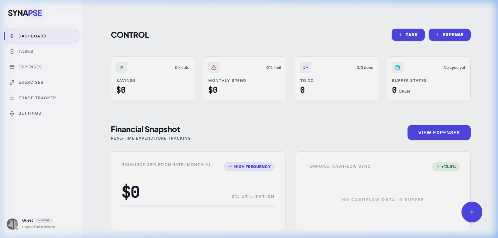
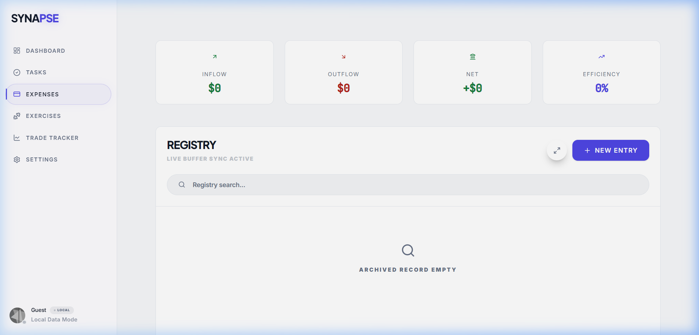

<div align="center">
  
  
  # Synapse | Neural OS
  ### The Executive Command Center for Personal Optimization
</div>

---

## The Vision
As modern life scales in complexity, our critical metrics—**productivity**, **financial capital**, and **biological performance**—become scattered across fragmented, low-fidelity applications. 

**Synapse** is a unified "Neural Dashboard" designed for the modern high-performer. Serving as a central executive layer that bridges disparate life systems, Synapse consolidates task protocols, financial auditing, trade analysis, and physical exertion into an immersive, premium, ultra-responsive interface. 

---

## ⚡ Recent High-Performance & Architectural Upgrades

Synapse has recently undergone a major performance and user experience overhaul:

1. **Ultra-Performance Query Optimization**
   * Redesigned the live Firestore listening pipeline to leverage memory-cached aggregations, eliminating redundant Firestore reads and network payloads.
   * Restored resilient caching so users can view high-fidelity financial insights (monthly expenses, total net worth) instantly with zero blank loading screens.

2. **Refined PWA (Progressive Web App) Infrastructure**
   * Configured offline-first capabilities using `vite-plugin-pwa` and Workbox caching strategies.
   * Assets, SVG graphics, and web fonts are fully precached locally for instant load times and native app responsiveness on mobile.

3. **Premium "Obsidian" Mobile Navigation**
   * Streamlined the mobile navigation dock: lightened background values for elegant contrast, removed redundant icon text labels, and increased tap targets for an immersive, tactile experience.
   * Rewrote the pull-to-refresh spinner with zero-friction Framer Motion gesture physics that dismisses instantly once action resolves.

4. **Production Bundle Tree-Shaking**
   * Optimized asset loading and resolved barrel imports (specifically Lucide icons) to enable aggressive compiler tree-shaking. This shrunk main bundle payloads and significantly boosted initial page speed indices.

---

## Main Modules

* **Execution Engine (Tasks)**: A gamified system that categorizes objectives into Dailies (Protocols), Strategic Epics (Long-term), and Persistent Notes.
* **Resource Auditor (Finances)**: High-performance expense auditing with merchant-to-category learning, month-over-month cashflow forecasting, and aggregate spending metrics.
* **Trade Lattice (Trade Tracker)**: Post-trade analysis platform with automated exchange integration capabilities for algorithmic performance reviews.
* **Biological Status (Exercises)**: Monitoring physical exertion levels and active recovery metrics to ensure optimal human hardware performance.

---

## System Preview

### Mission Control (Dashboard)
The central nervous system. It provides a real-time visualization of your "Operator Status," current tasks (Protocols), and a high-level financial snapshot.


### Financial Auditor (Expenses)
A deep-dive ledger designed for auditing "Resource Depletion." It helps you visualize where capital is flowing and syncs against your monthly budget in real-time.


---

## Tech Architecture

* **Foundation**: React 19 + Vite 6 + TypeScript
* **Styling**: Tailwind CSS 4 (Oxide Engine) — Delivering a dark "Obsidian" neo-minimalist aesthetic.
* **Backbone**: Firebase v11 (Firestore, Auth, Hosting) for specialized real-time synchronization.
* **Fluidity**: Motion (Production-grade animations) for seamless transitions between life sectors.
* **Analytics**: Recharts & Lucide React for high-density data visualization.

---

## Installation & Deployment

1. **Clone the Neural Codebase**
   ```bash
   git clone https://github.com/Montasir00/Synapse.git
   cd Synapse
   ```

2. **Initialize Dependencies**
   ```bash
   npm install
   ```

3. **Establish Sync Links**
   Configure your `.env.local` with your Firebase credentials as specified in the template setup.

4. **Activate Mission Control**
   ```bash
   npm run dev
   ```

---

<div align="center">
  <sub>Synapse — Built for the disciplined. Refined for the elite.</sub>
</div>
